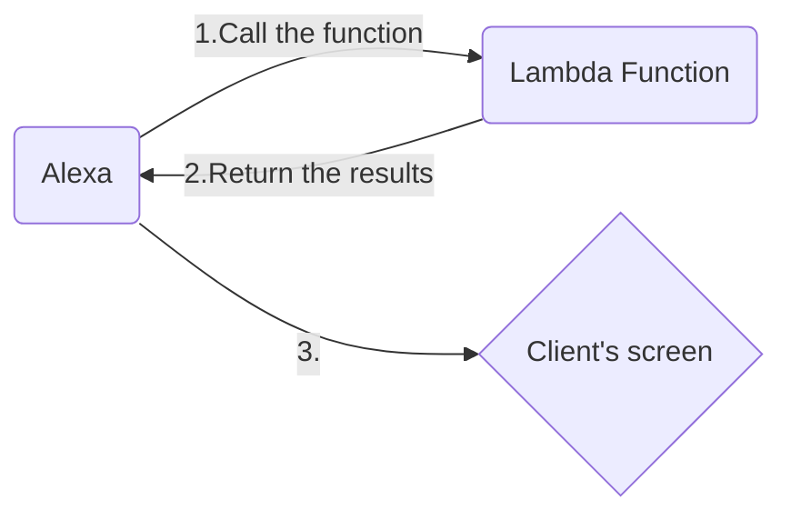


# Project Work PCTO GROUP 6

## Lambda

### Analysis and resolution

The project we worked on asked us to analyze a series of data regarding the distribution of vaccine doses of Covid-19 from the beginning of production up to the last few months in the various Italian regions.

The task has been divided into three main tasks:

1.  in the first task we were asked to input the name of the region in which to carry out the operations, the month and year we wanted to take into consideration for the calculation of the doses sent in total;
2.  the second task required to establish which region had received the maximum and minimum number of doses, given the month and the year of reference;
3.  the third task asked us to make the average of all the doses delivered in a given region, taken as input.

Firstly we analyzed the **structure** of the json file from which had to extract the information on vaccines and their distribution.
The structure of the file is a complex dictionary, containing a list of information for each day and country.  
Each element of the list is divided into several elements:

-   the index of the element within the list,
-   the supplier of the vaccine doses,
-   the number of doses delivered on that date and the date of delivery,
-   the ISTAT code of the region that received the doses,
-   the name of the region.

The json file contains about 6 thousand elements, which increaseas the time to carry out operations, for this reason we have to adopt strategies to optimize the calculation time of each instruction as much as possible becouse a lambda function on amazon server can be excecuted for no more than three seconds.

####  LAMBDA FUNCTIONS:
	Steps to make the lambda function work:

1. ***Make the lambda function***, the first step to do is to create the lambda function and code it in python. The most important details to keep in mind are:
	 -  Organise and set the layers for the requests module
	 -  Set the environment variables
	 -  Return a json format dictionary
	 
2. ***Set up an an API Gateway***, the second step is to create the API Gateway, create a resource and set a **get** method in the same resourse with the lambda function connected and in the end distribute the API in a **phase**;
4. ***Testing***, after the API setting, we now can run our lamda function by capying the url in the phase option and paste it in *postman*;
> **Carful:** The get method and post method are different to each others
5. ***Resolving bugs and testing again***, in the end we test again and again to improve the code and correct bugs until we have nothing left to correct.

---

#### MOST IMPORTANT FUCNTIONS

> All other codes are in the src folder in github

``` python
def get_data():
    """Get the data from the request"""
    url = os.getenv('URL')  # Get the URL from the environment variables
    api_response = requests.get(url)  # Get data
    data = api_response.text  # Convert the data to string
    parse_json = json.loads(data)  # Convert the string to a dictionary
    data = parse_json["data"]  # Get the value "data" in the dict

    return data


def check_country(data, region_name):
    """Check if the country name is correct"""
    region_name = region_name.strip().lower()
    # Check if the country name contains a number
    if region_name.isdigit():
        return "error"

    # Check if the country name exist in the list
    for k, info in enumerate(data):
        if info["nome_area"].lower() == region_name:
            return region_name
        # If end of the list
        if k + 1 == len(data):
            print(f"I dati della regione {region_name} non sono presenti nella lista")
            return "error"


def check_year_digits(year):
    """Check if the year is present in the string"""
    match = re.match(r"\d{4}", year)
    if match is not None:
        return match.group()
    return "error"


def check_year(period_year):
    """Check the year"""
    # Return current year if user doesn't input the year
    if period_year == "":
        return date.today().year
    # Check if the year contains a letter
    if not period_year.isdigit():
        return "error"
    # Check if the number of digits is correct
    if check_year_digits(period_year) == "error":
        return "error"
    period_year = check_year_digits(period_year)
    return period_year


def check_month(month_string):
    """Check if the month is correct"""
    # Month name list
    months = ["gennaio", "febbraio", "marzo", "aprile", "maggio",
              "giugno", "luglio", "agosto", "settembre", "ottobre",
              "novembre", "dicembre"]

    month_string = month_string.lower()
    # Return current month if user doesn't input the month
    if month_string == "":
        month_string = months[date.today().month - 1]
        return date.today().month, month_string
    # Check if the name of the month is correct
    if month_string.lower() in months:
        # Associate the month to it's number
        period_month = int(months.index(month_string.lower()) + 1)
        return period_month, month_string
    return "error", "error"


def get_vaccines_name(data):
    """Get the names of all the vaccines"""
    vaccine_names = {}
    for i, info in enumerate(data):
        vaccine_names[info["fornitore"]] = 0
    return vaccine_names


def overall_calc(data, region_name, period_year, period_month):
    """calculation of the overall doses"""
    # Initialization
    overall_doses = 0
    vaccine_names = get_vaccines_name(data)
    for i, info in enumerate(data):
        # Get the year and the month of the data if names match
        if region_name.lower() == info["nome_area"].lower():
            year = int(info["data_consegna"].split('-')[0])
            month = int(info["data_consegna"].split('-')[1])
            # Sum if the time is right
            if int(period_year) == year and period_month == month:
                overall_doses += info["numero_dosi"]
                # Add the vaccine number
                if info["fornitore"] in vaccine_names:
                    vaccine_names[info["fornitore"]] += info["numero_dosi"]

    return overall_doses, vaccine_names


def lambda_handler(event, context):
    """Lambda function"""
    try:
        info = event["queryStringParameters"]
        outdata = fucntion(info["parameter"])
        if outdata == "error":
            return {
                'statusCode': 400,
                'body': json.dumps("error, wrong variables")
            }
        return {
            'statusCode': 200,
            'body': json.dumps(outdata)
        }
    except:
        return {
            'statusCode': 400,
            'body': json.dumps("error, run interrupted")
        }

```

### RESOLUTION METHOD

For the resolution of the different tasks we have implemented 6 default functions and a function for each task's job.

|     Name     |REUSED FUNCTIONS|
|:----------|:--------:|
|*get_data*| we take the data that we are going to work with and convert them firstly into a string and then convert them into a dictionary, we then use an environment variable for the link to the json file from which we will extract the data |
|*check_country*| we check that the name of the region entered on input is correct or that it does not contain numbers; then we go to check that the region exists in the list of the json file and if it's present than it returns the name of the region, otherwise it returns "error" |
|*check_year*| function we check that the year insered is correct by firstly check if the year is not given, in this case it returnes the current year, then by checking if it actually contains digits and lastly if it contains a sequence of four digits by calling the "***function check_year_digits***" that using a regular expression checks and gets the first sequence of four digits, if all of this is not right, then i returns "error" |
|*check_month*| we check if a valid month is entered on input, then we also check that no numbers have been entered and lastly we convert the month into the corresponding number using a list of saved months names. if the name of the months is wrong it returns "error" |
|*get_vaccines_name*| we get the names of all the vaccines delivered in the regions, we save those in a dictionary and then return it |
|*lambda_handler*| returns the results to the client and checks for errors|
|**Name**    |**EACH TASK'S WORK FUNCTION**|
|*overall_calc*| we calculate the total doses that have been delivered. Firstly we call the "get_vaccines_name" fucntion and then with a loop we go through the whole json file, and for each element we compare the name of the country in the file with the name of the country took on input. For each correspondence, we check the month and year, and if they correspond to the month and year given on input we add the vaccine doses to the total and we add the number of vaccines type delivered. The function passes the data to work on, the name of the country, the month and the year as attributes. ***get_overall*** as main function. |
|*max_min_calc_time*| we go through a loop that iterates for each element of the json file, for each iteration checks if the number of doses delivered on that day is less or greater than the number of previous doses checked and if it's true we change the value. ***get_max_min_time*** as main function. |
|*sum_calc*| with a loop we check if the region is the same as the region taken on input, if true, we add all of the vaccines doses to the total and in the end we return it. ***get_avg*** as main function. |
|*max_min_calc_region*| with a loop we check if the region is the same as the region taken on input, if true, we check the maximum and minimum doses receaved and we return those. ***get_max_min_region*** as main function.|

## ALEXA

After having implemented all the lambda functions, we took care of creating the skills to be called in alexa to be able to correctly execute the various commands.
Simply, we call the lambda function of all the tasks and we extract the data from the returned json data.



#### HOW IT WORKS
	Steps to make Alexa work:

1. ***Set up an Alexa task***, the most important step is to create the actual skill that we need to call to make Alexa work and set a skill invocation name;
> **Skill invocation name warning:** The invocation name can't contain Alexa
2. ***Creating the intents***, after creating the skill, we need to create the intents, the requests that we are gonna ask Alexa to do for us. Every intent has his unique name and his uniques sentences to invoke them;
> **Intents extra:** Every intent has different invocation sentences
3. **Creating the intents slots**, the intens slots are those that we can call variables in IT programming and just like in programming they have a **slot type** in Alexa too. Those types can be Amazon.given types or Custom ( created by the programmer );
4. ***Start coding***, the first thing to do is to add the class function of the intent we need to invoke and then we add the class to the list of fucntions that are gonna be read in the end of the file;
5. ***Testing***, the last but not the least step to put in place is the testing ( execute ), here we are gonna test the Alexa skill completely and see if it contains some sort of bug;
6. ***Resolving bugs and testing again***, in the end, we correct everytype of bug and finish the work.

Every extra class added in alexa gets the data from the api url to the lambda function written in the AWS Server.

Most important functions:

| Name         |RETURN|
|:----------|:--------:|
|*regionOverallIntentHandler*| returns the number of dodes receaved in a region in a specific time |
|*timeMaxMinDosesIntentHandler*| returns the maximum and the minimum of the doses receaved in all the data in a specific time |
|*regionDosesIntentHandler*| returns the average doses receaved by a region |
|*regionMaxMinDosesIntentHandler*| returns the maximum and the minimum of the doses receaved by the regions in a specific time |

#### HOW TO RUN ALEXA

Firstly, we need to open the skill by opening the Alea Test section and writing the skill invocation name.
